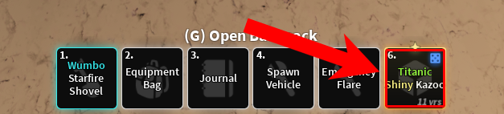

# Auto Appraiser by Riri – *Technica Exegesis ad Automatica Chromatica*

> *“Fiat pixelum inquisitionis.”* — Riri, circa 2025

**Auto Appraiser** is an extensible, configuration-bound, pixel-deterministic automation framework constructed atop the procedural runtime facilities provided by AutoHotkey v1.1. Its purpose, ostensibly simple—halt mouse interaction upon detection of a user-selected visual cue in the Roblox software experience *Dig!*—is in fact the result of a complex orchestration of stateful GUI interaction, color vector analysis, and mutex-based execution toggling.

This tool conducts an ongoing interrogatio chromatica (*color query cycle*) against bitmap data retrieved via synchronous screen polling over rectangular domains (*rectanguli inclusiones*), halting click emission **ipso facto** upon matching defined spectral signatures (*hexadecimales colorum*) under modal detection semantics.

---

## 🧩 Prerequisites *(Conditiones Praeviae: sine quibus non)*

To successfully instantiate and execute the Auto Appraiser utility in a Windows environment, the host system must satisfy the following fundamental conditions:

1. **AutoHotkey v1.1 Runtime Environment (32-bit)**
   The script assumes the presence of the AutoHotkey v1.1 execution environment, preferably the Unicode build variant. AHK v2+ introduces syntactic breaking changes and deviates from legacy scoping behavior; as such, this implementation does not support it either **de facto** or **de jure**.

2. **DirectX-accelerated GUI stack on Windows 10+**
   While not explicitly required, performance and color fidelity are assumed to match the Windows 10/11 compositor pipeline under DWM (Desktop Window Manager) with default gamma calibration.

---

## 🧱 Installation Protocol *(Ritus Installationis)*

The process of installing and initializing the Auto Appraiser subsystem is non-trivial, involving both file system manipulation and spatial cognition of graphical elements:

### Step 1: Repository Extraction

Users may opt for:

* A direct ZIP archive retrieval and manual extraction via GUI file browser.
* Or a minimal-depth Subversion export for users preferring source-tree granularity:

```bash
svn export https://github.com/AlinaWan/kc-dig-tool-configs/trunk/KC-Tool-Suite/auto-appraiser
```

> *Nota Bene:* This approach avoids `.git`-specific metadata pollution and is thus preferable for ephemeral deployments.

### Step 2: Executing the Orchestrator

Navigate to the directory containing the `.ahk` script and double-click it. This will:

* Instantiate the GUI runtime.
* Bind all global and scoped hotkeys (`F6`, modal toggles).
* Mount inclusion zone data (`inclusions.ini`) into memory.
* Initialize color detection lookup tables into an in-memory object literal.

The script now enters a passive polling state pending user interaction.

---

## 🧠 Runtime Semantics *(Semantica Temporis Currens)*

### Invocation

The user activates or deactivates auto-click behavior using the `F6` key. This keybind acts as a global toggle, interfacing with an internal flag (`clicking := true/false`) that gates downstream activity in the polling loop.

### Suspension Conditions

Execution enters a quiescent state under either of the following *conditions sine quibus non*:

1. **Foreground Context Loss**
   If the Roblox client is no longer the active window (`WinActive` returns false), input suppression is triggered and clicking is paused. This behavior is vital to avoid off-target interaction when switching applications.

2. **Modifier Match Detection**
   If any active chromatic target is found within any defined *regio inclusionis*, the clicking loop is immediately interrupted by control flow redirection (`return` from polling loop).

---

## 🧭 Graphical Interface Taxonomy *(Tabula Interfaciei Graphicae)*

The GUI is a tabbed interface constructed using AutoHotkey’s native GUI system (v1), divided into four functional partitions:

| Tab            | Function                                                                                                                                                                |
| -------------- | ----------------------------------------------------------------------------------------------------------------------------------------------------------------------- |
| **Main**       | Aggregates global parameters. Configurable fields include: `clickDelay` (in ms), `colorTolerance` (ΔE tolerance for RGB hex), and `pollingInterval` (loop cycle delay). |
| **Target**     | Represents a set of *checkbox + hex code* rows. These form the predicate set under which halting occurs.                                                                |
| **Inclusions** | UI for defining screen-space rectangular zones. These are the only regions considered during pixel scanning operations.                                                 |
| **Debug**      | Real-time console echo output. Logs function entry/exit, target matches, zone hits, and internal state toggles. Primarily for post hoc debugging.                       |

---

## 📌 Inclusion Zones *(De Rectangulis Inclusionis)*

Inclusion zones, stored persistently in `inclusions.ini`, represent absolute-position, fixed-dimension screen-space rectangles. They are the only regions within which pixels are sampled during execution. This design drastically reduces computational complexity from O(screen area) to O(zones × interval), improving efficiency and minimizing false positives.

### On Precision

The user is encouraged to exercise *magna diligentia* when defining inclusion regions. If the ROI (region of interest) overlaps with non-relevant UI elements—e.g., borders, background gradients, or shadows—color sampling will likely yield inaccurate results.

**Inclusion zones must be:**

* Precisely aligned to item slots in the hotbar.
* Consistently sized across sessions.
* Revalidated if resolution, display scaling, or window size changes.



---

## 🎯 Detection Model *(De Coloribus Obiectivis)*

Each modifier type (e.g., `Shiny`, `Titanic`, `Gargantuan`) is assigned:

* A detection flag (binary toggle)
* An associated hexadecimal RGB triplet (e.g., `0xFFF587`), representing the unique color of its in-game icon.

### 📐 Inclusion Zone Defaults & Configuration Protocol *(Configuratio Praedefinita et Modificatio Rectangulorum Inclusionis)*

#### 📊 Default Spatial Parameters *(Valoribus Praestitutis)*

The bundled configuration artifact `inclusions.ini`—a plaintext INI schema file encoded in UTF-8—contains a precomputed and hardcoded ROI (Region of Interest) mapping optimized for a highly specific execution topology. This default spatial configuration assumes the following system state *sub modo constantiae*:

* **Display resolution:** 1920 horizontal × 1080 vertical pixels (Full HD, 16:9 aspect ratio)
* **Operating System:** Microsoft Windows 11 (Build 22000+), with compositor active (`dwm.exe`)
* **Application Window State:** Roblox Client instantiated in **windowed** execution mode (non-fullscreen, with native window chrome visible)
* **Item Targeting Vector:** Focused exclusively on the **sixth** visual hotbar slot (counting from the primary/leftmost anchor), assuming a **fully populated** hotbar inventory panel.

#### ⚠️ Mutation Contingencies *(Conditiones Mutationis)*

If any of the aforementioned environmental invariants are violated or otherwise diverge from the default assumptions—whether by user intention or *casus fortuitus*—the default rectangular regions defined in `inclusions.ini` will no longer correspond to their intended pixel loci. This will result in *false negatives*, detection failure, or degenerate behavior.

You are required to manually redefine inclusion coordinates if:

* Your display device operates at a **non-1920×1080 resolution** (e.g., 1366×768, 2560×1440, ultrawide formats, or anything involving non-integer DPI scaling).
* The Roblox application is executed in **fullscreen** or **borderless fullscreen** modes, which invalidate static coordinate assumptions due to window-to-viewport normalization.
* You intend to target **any hotbar slot other than the sixth**, including but not limited to slots 1–5 or any slots extending beyond 6.

### 🔧 Inclusion Zone Authoring Workflow *(Procedura Manualis Configurationis Inclusionis)*

To define or modify a rectangular ROI (*Regio Inclusionis*), perform the following exhaustive manual steps via the built-in graphical configuration interface:

1. Invoke the GUI subsystem (if not already active) by executing the primary AHK script.

2. Navigate to the tab labeled **Inclusions**, which contains the `ListView` enumeration of currently registered zones.

3. Click the **Add Inclusion** button to open the coordinate input modal.

4. In the dialog box, provide **two Cartesian coordinate pairs** using **absolute screen-space pixel units**:

   * `X₁, Y₁`: Represents the **top-left vertex** of the inclusion rectangle. This point defines the origin (minimum X, minimum Y) of the region.

   * `X₂, Y₂`: Represents the **bottom-right vertex**. This point defines the closure boundary (maximum X, maximum Y).

   > ⚠ *Nota bene:* Coordinate inputs are **not relative** to the application window or any viewport. They are anchored to the global screen buffer origin (0,0 at top-left of primary monitor).

5. Use AutoHotkey’s built-in **Window Spy** utility to obtain exact coordinate values. This tool provides real-time cursor position tracking across all layered windows and composited surfaces.

6. After entering values, confirm via the **OK** control, which commits the coordinates to memory and persists them to the `inclusions.ini` file.

7. To remove an inclusion zone, highlight the corresponding row in the `ListView` pane and press **Remove Inclusion**, which will:

   * Remove the entry from the in-memory array,
   * Delete the block from `inclusions.ini`,
   * Re-index remaining zones to preserve monotonic zone enumeration.

### Modal Matching Semantics

Detection logic is parameterized by the **Match Mode**, selected from the `Main` tab:

* **OR Mode** (*modus disiunctivus*)  
  Script halts if *any* active modifier color is found in *any* region.

* **AND Mode** (*modus conjunctivus universalis*)  
  Halts only if *all* active modifier colors are simultaneously matched in a single cycle. Useful for compound criteria.

Mode is controlled via radio button interface bound to a global mode enum.

---

## 🧪 Edge Case Enumeration *(Casuum Limitalium Index)*

> *Caveat lector:* The following scenarios are known to produce non-deterministic or degraded behavior.

* **Color Ambiguity:**  
  `Gargantuan` and `Titanic` use *indistinguishable chromatic encodings*. The script cannot, and will not, differentiate them. This is a hard constraint imposed by Dig's UI layer and not addressable within current bounds of implementation.

* **Dark Modifier Instability:**  
  The `Dark` modifier uses `0x4F4F4F`, a mid-gray indistinguishable from hotbar background gradients under certain gamma profiles. Try adjusting `colorTolerance` to ≤3 to avoid spectral collision.

* **Resolution Drift:**  
  Zones are screen-locked. Any change in DPI, resolution, or window positioning invalidates prior zone configs. Always recalibrate if any of these variables mutate.

* **Volatile GUI State:**  
  Target color selections made via GUI are **not persisted** to disk. They reset on each execution cycle. This is intentional to ensure consistency with baseline configuration. *Fiat lux* if you want to hardcode your preferences.

---

## ⚖ License *(Lex Libera)*

Auto Appraiser is made available under the [MIT License](LICENSE), which is to say, you can do almost anything with it—copy, modify, sublicense, deploy commercially—*sub conditionibus* of attribution and warranty disclaimer. For more information, refer to the full license text.

---

## 🧠 Final Observations *(Appendix Epilogica)*

This tool was designed under the assumption of *status normalis monitorum*. It does not support environments with active color filters (Night Light, HDR, f.lux, or “Gamer RGB Boost Mode”) which alter on-screen pixel values in post-processing. Such environments render detection unpredictable or fully inert.

For maximum fidelity:

* Use native resolution.
* Disable all post-processing overlays.
* Maintain standard luminance and gamma.