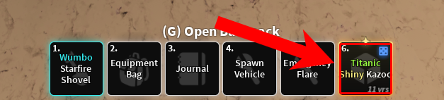

<div align="center">
  <h1>Auto Enchanter</h1>
</div>

> *“Per colorum signa salus.”* — Riri, circa 2025

**Auto Enchanter** is an extensible, configuration-bound, pixel-deterministic automation framework constructed atop the procedural runtime facilities provided by AutoHotkey v1.1. Its purpose, ostensibly simple—halt mouse interaction upon detection of a user-selected visual cue in the Roblox software experience [*Dig!*](https://www.roblox.com/games/126244816328678)—is in fact the result of a complex orchestration of stateful GUI interaction, color vector analysis, and mutex-based execution toggling.

This tool conducts an ongoing interrogatio chromatica (*color query cycle*) against bitmap data retrieved via synchronous screen polling over rectangular domains (*rectanguli inclusiones*), halting click emission **ipso facto** upon matching defined spectral signatures (*hexadecimales colorum*) under modal detection semantics.

See also: [Auto Chiseler](https://github.com/AlinaWan/auto-chiseler)

---

## 📦 Requirements

Before using the script, ensure you have the following:

* **AutoHotkey v1.1**  
  Download it from: [https://www.autohotkey.com](https://www.autohotkey.com)

---

### 🛠️ Installation & Setup

Follow these steps to get started:

1. **Download the script**

   * Download the latest version of Auto Enchanter, OR:
   * Export the Auto Enchanter directory using SVN:

     ```bash
     svn export https://github.com/AlinaWan/kc-dig-tool-configs/trunk/KC-Tool-Suite/auto-enchanter
     ```

2. **Run the script**

   * Double-click the script to launch the GUI.

3. **Add at least one inclusion zone**

   * Before using the auto-enchanter, you **must define at least one inclusion zone** through the **Inclusions** tab in the GUI.
   * These zones tell the script where on screen to look for modifier colors.
   * If no zones are added, the script has nothing to scan and will not function correctly.

---

## 🖥️ Using the Script

### Launching and Toggling

* Press `F6` to start or stop auto-clicking.
* The script will pause automatically if the Roblox window loses focus or your target modifier is found.

---

## 🧭 GUI Overview

The GUI includes four tabs:

* **Main** – General settings (Key Hold Time, Color Tolerance, Polling Interval)
* **Target** – Choose which enchant colors stop enchanting
* **Inclusions** – Define exact screen regions to scan
* **Debug** – View real-time script messages and actions

---

## 🎯 Inclusion Zones (`inclusions.ini`)

Inclusion zones tell the script *where* to look for enchant colors.

### What Should a Zone Be?

Each zone should **closely match the pixel bounds of the shovel hotbar-item** you're enchanting (e.g., the 1st hotbar slot).
**Avoid including any pixels outside the item square**, such as beyond the background UI, as they can interfere with detection.  



### Default Configuration

The included `inclusions.ini` is pre-set for:

* 1920×1080 resolution
* Roblox in **windowed mode** on **Windows 11**
* Targeting the **1st hotbar slot** with a full hotbar

You will need to adjust the zones if you are using:

* A different resolution
* A different windowed/fullscreen mode
* A different hotbar slot

### How to Add/Remove Zones

#### Option 1 (Recommended)

1. Open the GUI and go to the **Inclusions** tab.
2. Click **Drag to Select Zone**.
3. Drag the inclusion area on the screen.

#### Option 2 (Manual)

1. Open the GUI and go to the **Inclusions** tab.
2. Click **Add Inclusion**.
3. Enter two Cartesian coordinate pairs:

   * **Top-Left (X1, Y1)** – Upper-left corner of the zone
   * **Bottom-Right (X2, Y2)** – Lower-right corner of the zone

4. Use AutoHotkey's **Window Spy** tool to get exact pixel coordinates.
5. Click **OK** to save the zone.
6. To remove a zone, select it from the list and click **Remove Inclusion**.

---

## 🎨 Stop Conditions (Target Tab)

The **Target** tab defines which visual enchants should stop the auto-enchanting when detected.

Each row includes:

* **Checkbox** – Enable or disable detection for that enchant.
* **Hex Color Box** – The exact RGB hex code to detect (e.g., `FA9B3C` for Chrono).

---

## ⚠️ Notes & Warnings

* 🕶️ **Noir Enchant Warning**  
  The color `0x979797` (the color of the Noir enchant) is nearly identical to the hotbar background. This may cause false detections unless tolerance is tuned carefully.

* 🎚️ **Color Tolerance**  

  * Lower tolerance = stricter match (less false positives, but may miss minor shifts)
  * Higher tolerance = more forgiving (but may trigger incorrectly)

* 🖥️ **Resolution & Position Sensitivity**  
  Inclusion zones use **absolute screen coordinates**.
  If you change resolution, move the Roblox window, or switch displays, you must reconfigure your zones.

* 🎨 **Target Color Codes**  
  Changes made to the target colors in the GUI do not persist after closing the script. This is intentional as the defaults are already optimized for typical systems.
  You usually don’t need to change them unless using custom screen filters or displays.

---

## 📄 License

Auto Enchanter is licensed under the [MIT License](LICENSE).
